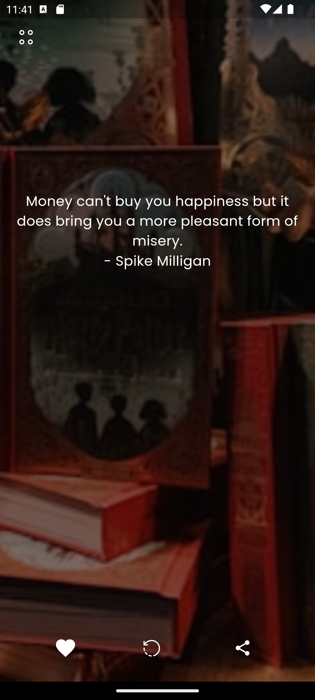
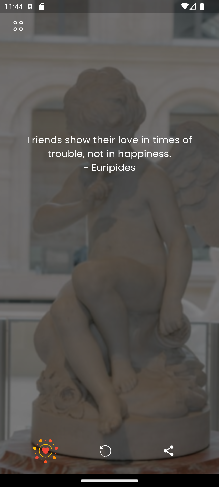
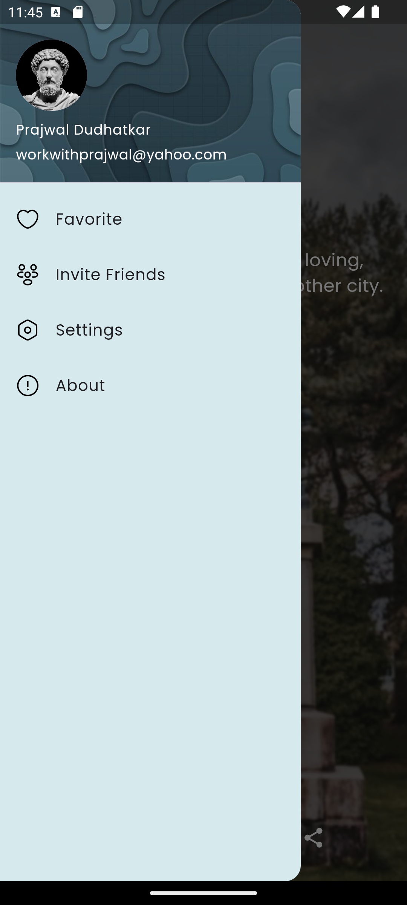
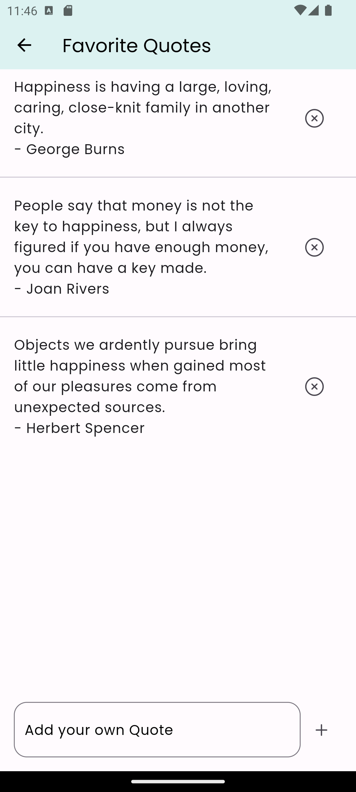
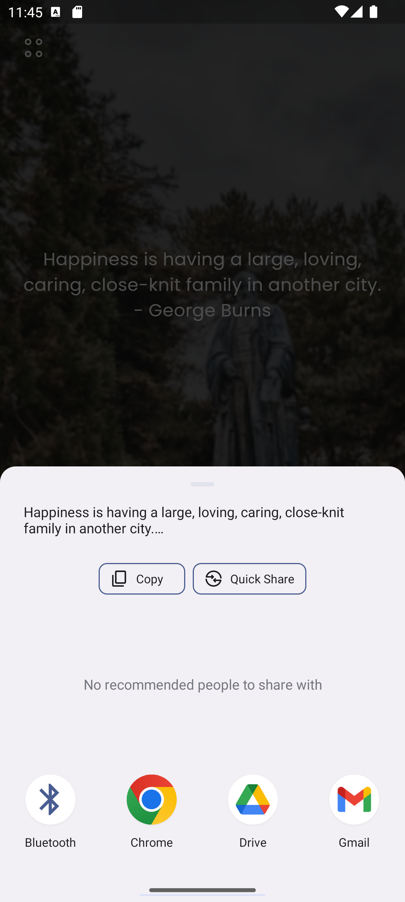

# Quote of the Day App

Welcome to the Quote of the Day app! This Flutter application provides users with a daily dose of inspiration by fetching a new quote and displaying it along with a beautiful background image. The app utilizes two APIs - one for fetching background images and another for retrieving quotes.

## Features

- **Daily Quote:** Every time you open the app, a new inspiring quote is displayed.
- **Background Image:** The app fetches a captivating background image to complement the quote.
- **Save to Favorites:** Save your favorite quotes to easily access them later.
- **Add Custom Quotes:** Add your own quotes to the favorites list for personal inspiration.
- **Share Quote:** Share a quote with friends and family via social media or messaging apps.
- **Refresh Button:** Load a new quote and background image at any time with the refresh button.

## Screenshots

  
  
  
  
  

## APIs Used

- **Unsplash API**: Used for fetching background images.
- **API Ninja**: Used for retrieving quotes.
